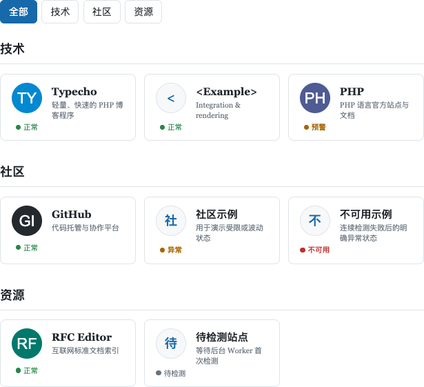
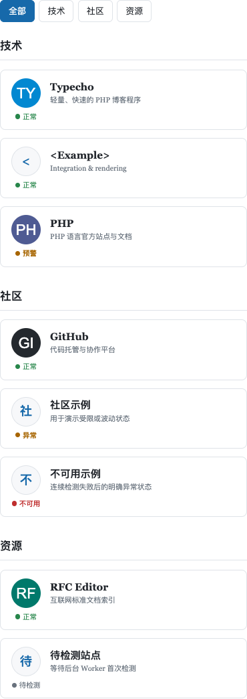
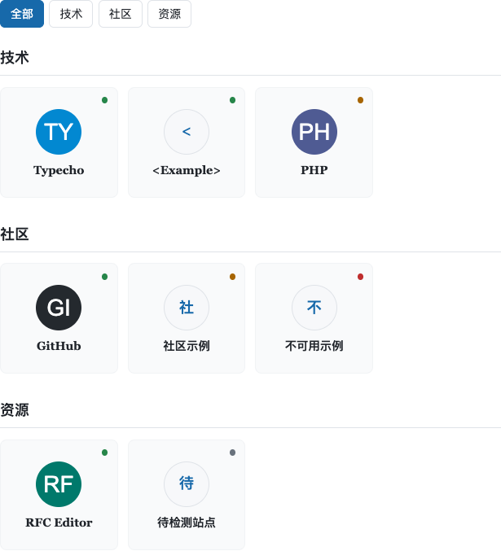
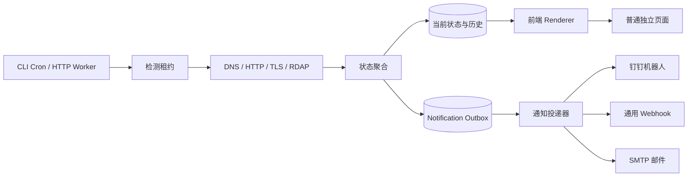

# FriendLinks

面向 Typecho 1.2+ 的独立友情链接管理、展示、健康检测与通知插件。

FriendLinks 不依赖主题的友链模板，也不会在访客请求中临时探测远端网站。插件使用独立数据表和后台菜单管理友链，通过 CLI Cron 或签名 HTTP Worker 执行 DNS、HTTP、TLS 与 RDAP 检测，并在状态变化时发送钉钉、通用 Webhook 或 SMTP 邮件通知。

- 作者：[NHPT](https://github.com/NHPT)
- 许可证：MIT
- PHP：7.4 或更高版本（已测试至 8.5）
- 数据库：MySQL / MariaDB、PostgreSQL、SQLite



## 核心能力

| 能力 | 说明 |
| --- | --- |
| 主题解耦 | 使用普通独立页面和 Typecho 标准钩子，不要求主题提供 `page-links.php` 或专用函数 |
| 独立管理 | 友链、分类、健康、历史、导入导出、通知和设置均位于独立后台菜单 |
| 多维检测 | DNS、HTTP、重定向、TLS 证书、域名 RDAP 到期信息 |
| 状态聚合 | 连续失败阈值、组件独立周期、随机抖动、失败退避和数据过期判断 |
| 主动通知 | 钉钉加签机器人、通用 Webhook、SMTP 邮件、可编辑纯文本模板 |
| 持久化投递 | 检测结果与通知事件原子入库，Outbox 异步发送、租约恢复、冷却去重和最多五次尝试 |
| SSRF 防护 | 拒绝私网与保留地址，固定已验证 DNS 结果，核对实际连接 IP，逐跳验证重定向 |
| 多数据库 | 自动识别 MySQL、PostgreSQL 和 SQLite，并执行版本化迁移 |
| 安全生命周期 | 停用保留全部数据，只有显式卸载并二次确认才删除表和配置 |
| 数据交换 | 支持 JSON 和 CSV 导入导出，CSV 自动防护电子表格公式注入 |

## 展示效果

### 卡片网格

圆形 Logo、名称、描述和简短状态保持固定信息层级。桌面端悬停或键盘聚焦时，描述切换为完整状态原因；移动端保持单列，不依赖悬停才能理解状态。



### Logo 方阵

Logo 方阵用于更强调站点标识的页面：隐藏描述，右上角仅保留状态灯，避免状态文字和分隔栏挤压内容。



内置模板包括：

- 卡片网格：名称、描述与简短状态，悬停显示完整原因。
- 紧凑列表：单列高密度布局，状态与检测时间分行显示。
- 站点目录：弱化边框，状态位于右上并与标题对齐。
- Logo 方阵：紧凑标识墙，右上角显示状态灯。
- 极简文字：隐藏 Logo 和描述，只保留名称与公开状态。

后台设置页提供真实数据结构的桌面端和移动端预览。预览不请求外部网站，也不写入数据库。

## 环境要求

- Typecho 1.2.0 或更高版本
- PHP 7.4 或更高版本
- MySQL / MariaDB、PostgreSQL 或 SQLite
- PHP cURL：健康检测、RDAP、钉钉和通用 Webhook 必需
- PHP intl：安全检测国际化域名时必需
- PHP OpenSSL：使用 STARTTLS 或 SMTPS 邮件通知时必需

缺少 cURL 时仍可管理和展示友链，但不能启用自动检测，也不能发送 HTTP 类通知。

## 安装

1. 从 [GitHub Releases](https://github.com/NHPT/FriendLinks/releases/latest) 下载最新稳定版 `FriendLinks.zip`，不要直接使用缺少 `vendor/` 的源码归档。
2. 将目录放入 Typecho 的 `usr/plugins/`。
3. 在 Typecho 后台启用 FriendLinks。
4. 打开“友情链接 → 设置”，选择一个已发布的普通独立页面，或由插件创建页面。
5. 配置系统 Cron。
6. 如需主动告警，在“友情链接 → 通知”中配置渠道并发送测试通知。

发布包已包含 Composer 依赖，生产服务器不需要执行 `composer install`。
如果使用 Git 仓库源码，则必须先在插件目录执行 `composer install --no-dev --optimize-autoloader`，再将完整目录部署到服务器。

首次添加友链时，打开“友情链接 → 友链”，点击“新增友链”，填写名称和 HTTP/HTTPS 地址；描述、Logo、分类和排序可选。有 cURL 时保持“公开”与“启用自动检测”，保存后启动一次 Worker；缺少 cURL 时关闭自动检测，友链仍可公开展示。

承载页必须满足：

- 类型为独立页面并且已经发布。
- 没有访问密码。
- 使用主题的普通页面模板。
- 主题按 Typecho 规范调用 `$this->content()` 和 `$this->header()`。

插件按页面 CID 在正文后追加友链列表，不修改主题文件。更换符合 Typecho 规范的主题后，友链数据、检测任务和通知配置不会丢失。

## 定时检测

### CLI Cron

推荐每 5 分钟运行一次：

```cron
*/5 * * * * php /path/to/typecho/usr/plugins/FriendLinks/bin/console.php check --due --limit=50 --max-seconds=240
```

CLI Worker 只领取已到期任务。后台“立即检测”和“完整复检”只调整调度时间，不会在后台页面请求中同步访问远端站点。

配置 Cron 前先在终端手动执行一次。成功时输出一行 JSON，包含 `claimed`、`completed`、`failed` 和 `notifications`；核心检测全部失败时返回非零退出码。Cron 应使用与站点一致的 PHP CLI 可执行文件，并保留错误日志，例如：

```cron
*/5 * * * * /usr/bin/php /path/to/typecho/usr/plugins/FriendLinks/bin/console.php check --due --limit=50 --max-seconds=240 >> /var/log/friendlinks-worker.log 2>&1
```

一次 `check` 同时处理到期检测和通知 Outbox，不需要额外的通知 Cron。

### 签名 HTTP Worker

无法使用系统 Cron 时，可以调用设置页显示的 HTTP Worker。该入口只接受 HTTPS `POST`，并要求：

```text
X-FLM-Timestamp
X-FLM-Nonce
X-FLM-Signature
```

签名原文为五行：

```text
POST
/实际请求路径
Unix 时间戳
随机 nonce
SHA-256(请求体)
```

使用设置页生成的密钥计算 HMAC-SHA256。时间窗口为 5 分钟，同一 nonce 只能使用一次。HTTP Worker 单次最多处理 5 条友链，目标运行预算为 20 秒。

`request path` 只取 Worker URL 的路径部分，不包含域名和查询串；签名输出为 64 位小写十六进制字符串。请求体可以使用空 JSON 对象。下面的 PHP 示例可直接放入定时脚本：

```php
<?php

$workerUrl = 'https://blog.example.com/index.php/friendlinks/worker';
$secret = '设置页显示的 Worker 密钥';
$body = '{}';
$timestamp = time();
$nonce = bin2hex(random_bytes(16));
$path = parse_url($workerUrl, PHP_URL_PATH);
$canonical = "POST\n{$path}\n{$timestamp}\n{$nonce}\n" . hash('sha256', $body);
$signature = hash_hmac('sha256', $canonical, $secret);

$curl = curl_init($workerUrl);
curl_setopt_array($curl, [
    CURLOPT_POST => true,
    CURLOPT_POSTFIELDS => $body,
    CURLOPT_HTTPHEADER => [
        'Content-Type: application/json',
        'X-FLM-Timestamp: ' . $timestamp,
        'X-FLM-Nonce: ' . $nonce,
        'X-FLM-Signature: ' . $signature,
    ],
    CURLOPT_RETURNTRANSFER => true,
    CURLOPT_CONNECTTIMEOUT => 5,
    CURLOPT_TIMEOUT => 30,
]);
$response = curl_exec($curl);
$error = curl_error($curl);
$status = (int) curl_getinfo($curl, CURLINFO_RESPONSE_CODE);
curl_close($curl);

if (false === $response || $status < 200 || $status >= 300) {
    fwrite(STDERR, "FriendLinks Worker failed: HTTP {$status} {$error}\n");
    exit(1);
}
$result = json_decode($response, true);
if (!is_array($result)) {
    fwrite(STDERR, "FriendLinks Worker returned invalid JSON\n");
    exit(1);
}
fwrite(STDOUT, $response . PHP_EOL);
```

建议仍每 5 分钟调用一次，并让服务器通过 NTP 保持时间同步。`nonce` 必须为 16 至 128 位字母、数字、下划线或连字符组成的随机字符串。

PHP 标准 `dns_get_record()` 没有单次调用超时参数。插件会在 DNS 查询前后检查总预算并续租，但无法中断已经阻塞的系统解析调用；极端 DNS 故障下，HTTP Worker 可能晚于目标预算返回。因此生产环境优先使用 CLI Cron，并合理配置操作系统 DNS 超时。

## 健康检测

每个组件拥有独立检测周期：

- DNS：解析 A、AAAA 和 CNAME，拒绝任何非公网结果。
- HTTP：手动跟随重定向，识别 2xx、401/403、404/410、429、5xx 和网络错误。
- TLS：验证证书链、主机名和有效期，不允许关闭校验后降级重试。
- RDAP：依据 Public Suffix List 提取注册域名，并从 IANA Bootstrap 选择注册局端点。

默认连续三次主链路失败后才将友链标记为“不可用”。证书过期、证书尚未生效、主机名不匹配和证书链不可信会立即标记为不可用。

公开状态包括：

| 状态 | 含义 |
| --- | --- |
| 等待检测 | 新增或目标地址变更后尚未得到结论 |
| 正常 | DNS、HTTP 和 TLS 主链路正常 |
| 需要关注 | 证书或域名即将到期 |
| 不稳定 | 临时失败、访问受限或尚未达到连续失败阈值 |
| 不可用 | 达到连续失败阈值或存在确定 TLS 错误 |
| 状态未知 | Worker 异常、数据过期或外部数据没有结论 |
| 未检测 | 管理员关闭了自动检测 |

修改友链目标 URL 或重新启用检测时，插件会清空旧目标状态、撤销旧租约并立即安排新检测，避免把原站点的健康状态错误展示到新地址。

## 通知

通知默认关闭。启用后可分别选择以下事件：

- 站点从其他状态进入“不可用”。
- 进入“需要关注”或“不稳定”，以及这两种状态的原因码发生变化。
- 站点从预警、不稳定或不可用恢复为正常。

同一友链、事件和渠道在冷却时间内只创建一条通知，默认冷却时间为 3600 秒。事件与检测结果在同一数据库事务中写入，网络投递在事务提交后执行，因此通知服务故障不会回滚检测结果。

通知采用至少一次投递语义。失败后依次等待约 5、10、20、40 分钟重试，第五次仍未完成则进入失败终态，可在后台人工重试。每条事件包含稳定的 `event_id`；通用 Webhook 接收方应使用该字段去重。

### 通用 Webhook

要求 HTTPS 地址。每次请求发送 JSON：

```json
{
  "event_id": "sha256-event-id",
  "event": "down",
  "occurred_at": 1700000000,
  "link": {
    "id": 42,
    "name": "Example",
    "url": "https://example.com/"
  },
  "status": {
    "previous": "degraded",
    "current": "down",
    "reason_code": "http_unreachable",
    "http_code": null,
    "response_time_ms": 1200,
    "checked_at": 1700000000
  },
  "subject": "[FriendLinks] Example 站点不可用",
  "message": "..."
}
```

配置签名密钥后，请求还包含：

```text
X-FriendLinks-Timestamp: 1700000000
X-FriendLinks-Signature: sha256=<hex>
```

签名算法：

```text
HMAC-SHA256(secret, timestamp + "\n" + raw_request_body)
```

签名值使用小写十六进制，并带 `sha256=` 前缀。接收方应原样读取请求体，以常量时间比较签名，拒绝与当前时间相差超过 5 分钟的时间戳，并缓存 `event_id` 防止重复处理。通用 Webhook 不单独发送 nonce，重放控制由时间戳和 `event_id` 共同完成。

生产环境强烈建议配置签名密钥。接收端应按固定顺序处理：

```text
读取原始请求体
  -> 检查时间戳是否在 5 分钟内
  -> 计算并常量时间比较 HMAC 签名
  -> 解析 JSON
  -> 在数据库中原子登记 event_id
  -> event_id 已存在则直接返回 2xx
  -> 执行业务逻辑并返回 2xx
```

`event_id` 在自动重试和人工重试时保持不变。接收端至少保留 90 天去重记录，或按自身业务保留期设置更长时间。

Webhook 使用与健康检测相同的 SSRF 防护：禁止 HTTP、私网、回环、保留地址和 DNS Rebinding，并且不跟随重定向。

### 钉钉机器人

支持钉钉自定义机器人：

1. 在群设置中创建自定义机器人。
2. 复制 `https://oapi.dingtalk.com/robot/send?access_token=...` 地址。
3. 如果机器人启用了“加签”，同时填写以 `SEC` 开头的密钥。
4. 保存后点击“测试钉钉机器人”。

插件会按钉钉规范生成毫秒时间戳和 HMAC-SHA256 签名，发送纯文本消息，不在日志或投递记录中保存机器人地址和密钥。

### SMTP 邮件

SMTP 支持：

- STARTTLS
- SMTPS
- 无加密连接
- 可选 SMTP 用户名与密码
- 最多 20 个收件地址
- 自定义发件地址和发件人名称

邮件由 PHPMailer 发送，TLS 模式始终校验证书。后台不会回显已保存的 SMTP 密码。

配置顺序：

1. 打开“友情链接 → 通知”，启用 SMTP 邮件。
2. 填写 SMTP 主机和端口。常见组合为 STARTTLS `587`、SMTPS `465`；以邮件服务商文档为准。
3. 填写 SMTP 用户名与密码。启用双重验证的邮箱通常需要应用专用密码。
4. 填写发件地址、发件人名称和收件地址。
5. 保存设置，再点击“测试 SMTP 邮件”。
6. 若失败，在“最近投递”查看摘要，并检查服务器时间、DNS、出口端口、防火墙、账号授权和证书链。

HTTP Worker 的目标预算较短；收件人较多或 SMTP 响应较慢时，Dispatcher 会保留待发送记录而不强行越过预算。需要多个收件地址时应使用推荐的 CLI Cron。

### 消息模板

标题和正文可以修改，支持以下占位符：

| 占位符 | 内容 |
| --- | --- |
| `{{event_name}}` | 站点不可用、站点已恢复、状态预警或测试通知 |
| `{{link_name}}` | 友链名称 |
| `{{link_url}}` | 友链地址 |
| `{{previous_state}}` | 变化前中文状态 |
| `{{current_state}}` | 当前中文状态 |
| `{{status_summary}}` | 当前状态与原因摘要 |
| `{{reason}}` | 中文原因 |
| `{{reason_code}}` | 内部稳定原因码 |
| `{{http_code}}` | HTTP 状态码 |
| `{{response_time_ms}}` | 响应时间 |
| `{{checked_at}}` | 检测时间 |
| `{{cert_expires_at}}` | TLS 证书到期时间 |
| `{{domain_expires_at}}` | 域名到期时间 |

模板只进行白名单变量替换，不执行 HTML、PHP、JavaScript 或任意表达式。标题上限为 240 字节，正文上限为 12000 字节；未知变量、未闭合变量、空模板和超长模板会在保存时被拒绝。没有对应检测值的时间、状态码和耗时变量渲染为“无”。

## 数据导入与导出

支持 JSON 和 CSV。两种格式均与主题无关，适合备份或从其他插件迁移。

- 单次导入最多 500 条，超过时明确拒绝，不会静默截断。
- 导入前先展示预览、重复 URL 和字段错误。
- 新分类和对应友链在同一事务写入，失败时不会遗留空分类。
- JSON 保留字段原值。
- CSV 增加 `_flm_csv_encoding=formula-safe-v1` 标记列。对去除前导空白和单引号后以 `=`、`+`、`-`、`@` 开头的字符串，导出时增加一个单引号；重新导入带标记的文件时只移除这一层保护，因此原值可以往返恢复。
- 导出包含全部友链，不受后台列表分页上限影响。

CSV 使用 UTF-8（无 BOM）、英文逗号分隔和标准双引号转义。`name`、`url` 为必需列，其余列可选：

```csv
name,url,description,logo_url,category,sort_order,visibility,check_enabled,_flm_csv_encoding
Example,https://example.com/,示例站点,,推荐,10,published,1,formula-safe-v1
'=Formula,https://formula.example.com/,公式前缀已转义,,测试,20,draft,0,formula-safe-v1
```

Excel 或 WPS 导入时应明确选择 UTF-8，不要直接以本地 ANSI 编码另存。第三方生成的普通 CSV 可以省略 `_flm_csv_encoding`；插件只会对带 `formula-safe-v1` 标记的行执行可逆还原。

不建议持续增加按主题名称区分的导入器，因为主题没有统一友链存储协议。优先将旧数据转换为 FriendLinks 的 JSON 或 CSV 格式。

## 展示模板扩展

模板应安装到插件目录下的 `FriendLinks/templates/<name>/`。目录结构：

```text
templates/my-layout/
├── manifest.json
└── style.css
```

清单示例：

```json
{
  "title": "我的布局",
  "description": "继承卡片语义并调整颜色和间距。",
  "layout": "cards"
}
```

`layout` 只能使用 `cards`、`compact`、`logo-grid`、`directory` 或 `minimal`。模板只包含 JSON 清单和隔离 CSS，不执行 PHP、自定义 HTML 或 JavaScript。

加入目录后刷新“友情链接 → 设置”，新模板会自动出现在“前台布局”下拉框和预览区域。主题可覆盖 `.flm-root` 上的公开 CSS 变量调整配色。插件不检测主题名称，也不包含特定主题分支。

## 安全设计

- 前台页面只读数据库，不触发外部网络请求。
- 所有管理面板和写操作仅允许 `administrator`。
- 所有写操作使用 Typecho Security Token 防止 CSRF。
- SQL 通过 Typecho 查询构造器参数化执行。
- URL 只允许 HTTP/HTTPS 和 80/443 端口。
- DNS 结果必须全部为公网地址，并固定到 cURL 连接。
- 每次重定向重新解析和验证目标，实际连接 IP 必须属于已批准结果。
- cURL 禁用环境代理，HTTPS 强制验证证书链和主机名。
- HTTP Worker 使用 HMAC-SHA256、时间窗口、随机 nonce 和数据库唯一约束防重放。
- 通知地址、签名密钥和 SMTP 密码不回显，不写入通知错误记录。
- 消息模板不执行代码；所有后台与前台输出按 HTML 上下文转义。
- CSV 导出防护电子表格公式注入。

## 数据与生命周期

插件使用以下独立表：

```text
flm_categories
flm_links
flm_current_status
flm_check_history
flm_runs
flm_cache
flm_notification_outbox
```

激活时自动按当前数据库执行版本化迁移，不需要手动导入 SQL。当前 Schema 版本为 `2`。

- 停用：移除菜单、路由、Action 和前端钩子，保留表、友链、历史及通知配置。
- 再启用：自动恢复停用前配置并继续使用原数据。
- 显式卸载：在专用设置页输入 `DELETE` 后，才删除插件表和配置。

MySQL 插件表必须全部使用 InnoDB，以保证检测结果、历史和通知事件的事务一致性。

显式卸载不会删除承载页面，也不会删除服务器上的插件目录；页面正文和 URL 仍由 Typecho 保留，插件文件由站点管理员自行移除。

## 架构概览



更完整的技术设计见 [`docs/friend-links-architecture.md`](docs/friend-links-architecture.md)。

## 测试

领域测试：

```bash
php tests/run.php
```

Typecho 集成测试：

```bash
TYPECHO_TEST_ROOT=/path/to/typecho php tests/typecho-integration.php
```

集成测试会在测试站点中执行插件激活、迁移、CRUD、模板渲染、通知设置、Outbox 租约、失败重试、停用恢复和显式卸载。不要将测试根目录指向生产站点。

发布前验证覆盖：

- PHP 7.4、8.2、8.4、8.5
- Typecho 1.2.1
- SQLite 完整集成测试
- MySQL 8.4 与 PostgreSQL 16 迁移及重复执行
- Composer 依赖漏洞扫描
- 桌面端与移动端浏览器布局、Logo 裁切和悬停状态

## 常见问题

### 启用后前台没有列表

确认已经在“友情链接 → 设置”绑定已发布的普通独立页面，并检查主题是否调用 `$this->content()` 和 `$this->header()`。

### 后台点击“立即检测”后状态没有变化

该操作只把任务标记为到期。请确认系统 Cron 或签名 HTTP Worker 正常运行。

### 服务器缺少 cURL

后台会显示缺少扩展的提示，新友链不能启用自动检测，钉钉与通用 Webhook 也无法发送。已有配置和数据会保留，前台展示不受影响；SMTP 渠道测试仍可使用，但没有新的健康检测结果时不会产生状态变化通知。

### 为什么停用插件后数据仍然存在

这是有意的数据保护设计。升级、排错或临时停用不应删除友链。只有显式卸载操作才会删除数据。

永久删除前，先在“友情链接 → 导入导出”导出 JSON 备份，再进入“友情链接 → 设置 → 卸载并删除数据”，输入 `DELETE` 并确认。该操作会永久删除友链、分类、检测历史、运行记录和通知记录，无法从插件内恢复。

### 为什么通知没有立即发送

常规通知由 Worker 从 Outbox 异步领取。先检查全局通知开关、具体渠道开关、Worker 运行状态和“最近投递”中的错误摘要，再使用渠道测试按钮验证凭据。

### 可以直接修改消息模板为 HTML 吗

不可以。通知模板只支持纯文本和固定占位符，避免存储型 XSS、模板注入和不同渠道之间的格式差异。

## 第三方组件

- PHPMailer 6.12.0：SMTP 邮件发送
- Public Suffix List：注册域名识别

许可证详情见 [`THIRD_PARTY_NOTICES.md`](THIRD_PARTY_NOTICES.md)。

## License

[MIT](LICENSE)
